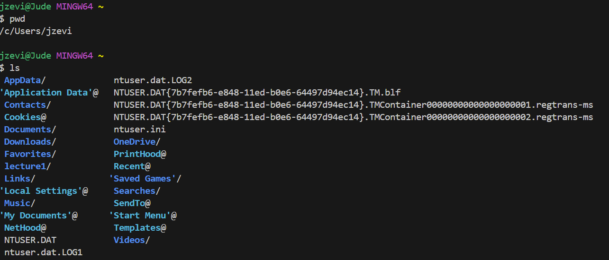
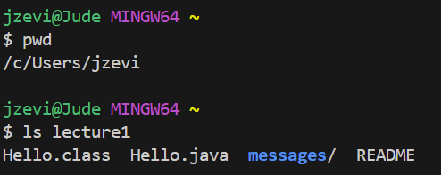
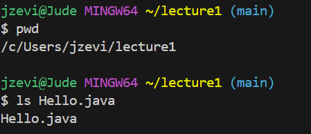
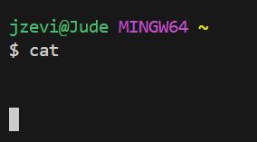
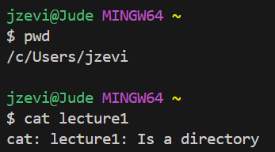
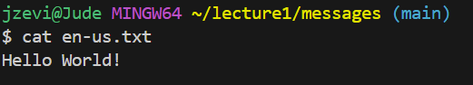

# Lab Report 1
---
**using 'cd':**

example 1, using the command with no arguments:

The absolute path before running the command was /c/Users/jzevi which is just the home or default starting path. When using the command 'cd' with no arguments, the path does not change at all since there were no arguments included. This is because the 'cd' command responds to a directory as an argument and takes the terminal to that directory, so when no argument is provided, it leaves you in the starting directory. This command takes you to your home directory. It's not an error, and the output will be empty.

example 2, using the command with a path to a directory as an argument:

The absolute path before running the command was /c/Users/jzevi which is just the home or default starting path. When using the command 'cd' with a path to the lecture1 directory as an argument, there is no output when the code is executed, but the terminal is now in a different directory as can be seen when checking the path after the command. This command changes the working directory to the specified directory. It's not an error, and you'll be taken into that directory, specifically the lecture1 directory for this example.

example 3, using the command with a path to a file as an argument:

The absolute path before running the command was /c/Users/jzevi which is just the home or default starting path. This will result in an error because 'cd' expects a directory path as an argument, not a file path

**using 'ls':**

example 1, using the command with no arguments:

This command lists the contents of the current directory. It's not an error, and the output will be a list of files and directories in '/home/user' since that was the starting path.

example 2, using the command with a path to a directory as an argument:

Using lecture1 as the specified directory and starting from /home/user. This command lists the contents of the specified directory. If the directory exists, it's not an error, and the output will be a list of files and directories in the specified directory.

example 3, using the command with a path to a file as an argument:

The starting location was in the lecture1 directory that contains the Hello.java file. This command will result in an error because ls expects a directory path as an argument, not a file path, so the output will just read Hello.java.

**using 'cat':**

example 1, using the command with no arguments:

The starting absolute path was /home/user. There was no output after this command was executed. This command will result in an error because cat expects at least one file as an argument

example 2, using the command with a path to a directory as an argument:

The starting absolute path was /home/user. The output gave us an error and said that lecture1 was a directory and not a file. This command will result in an error because cat expects a file path as an argument, not a directory path

example 3, using the command with a path to a file as an argument:

The starting absolute path was /home/user. This command will display the contents of the specified file. If the file exists, it's not an error, and the output will be the contents of the specified file or files.

