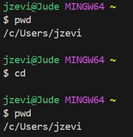

**Lab Report 1**

**using 'cd':**

example 1, using the command with no arguments:

When using the command cd with no arguments, the path does not change at all since there were no arguments included. This command takes you to your home directory. It's not an error, and the output will be the contents of your home directory.

example 2, using the command with a path to a directory as an argument:

example 3, using the command with a path to a file as an argument:

**using 'ls':**

example 1, using the command with no arguments:

example 2, using the command with a path to a directory as an argument:

example 3, using the command with a path to a file as an argument:

**using 'cat':**

example 1, using the command with no arguments:

example 2, using the command with a path to a directory as an argument:

example 3, using the command with a path to a file as an argument:

