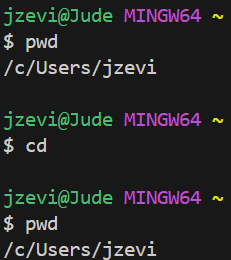

**Lab Report 1**

**using cd:**

example 1, using the command with no arguments:

example 2, using the command with a path to a directory as an argument:

example 3, using the command with a path to a file as an argument:

**using ls:**

example 1, using the command with no arguments:

example 2, using the command with a path to a directory as an argument:

example 3, using the command with a path to a file as an argument:

**using cat:**

example 1, using the command with no arguments:

example 2, using the command with a path to a directory as an argument:

example 3, using the command with a path to a file as an argument:

