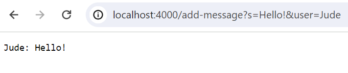
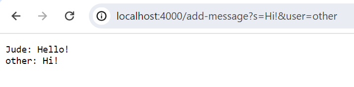

# **Lab Report 2**
---
**Part 1:**
code for ChatServer:
```
import java.io.IOException;
import java.net.URI;

class Handler implements URLHandler {
    // The single string to store chat messages
    StringBuilder chatMessages = new StringBuilder();

    public String handleRequest(URI url) {
        if (url.getPath().equals("/add-message")) {
            String query = url.getQuery();
            String[] parameters = query.split("&");
            String message = "";
            String user = "";
            // Extracting user and message from the parameters
            for (String parameter : parameters) {
                String[] keyValue = parameter.split("=");
                if (keyValue[0].equals("s")) {
                    message = keyValue[1];
                } else if (keyValue[0].equals("user")) {
                    user = keyValue[1];
                }
            }
            // Concatenate user, message and newline
            String formattedMessage = user + ": " + message + "\n";
            chatMessages.append(formattedMessage);
            return chatMessages.toString();
        } else {
            return "404 Not Found!";
        }
    }
}

class ChatServer {
    public static void main(String[] args) throws IOException {
        if(args.length == 0){
            System.out.println("Missing port number! Try any number between 1024 to 49151");
            return;
        }

        int port = Integer.parseInt(args[0]);

        Server.start(port, new Handler());
    }
}
```

Screenshots of using the `/add-message`:





1) Which methods in your code are called?
In the ChatHandler class, the handleRequest method is called.
2) What are the relevant arguments to those methods, and the values of any relevant fields of the class?
The relevant arguments are the URI object representing the request URL.
The chatMessages field of the ChatHandler class holds the current chat history.
3) How do the values of any relevant fields of the class change from this specific request? If no values got changed, explain why.
For the first request, the chatMessages field gets updated with the message "Jude:Hello!".
For the second request, the chatMessages field further updates with the message "other:Hi!".


**Part 2:**


I learned about the process of securely copying SSH keys to remote servers to enable passwordless SSH login. This procedure involves using the `ssh-copy-id` command to append the public key to the `authorized_keys` file on the remote device, enhancing security and convenience in remote access management.
