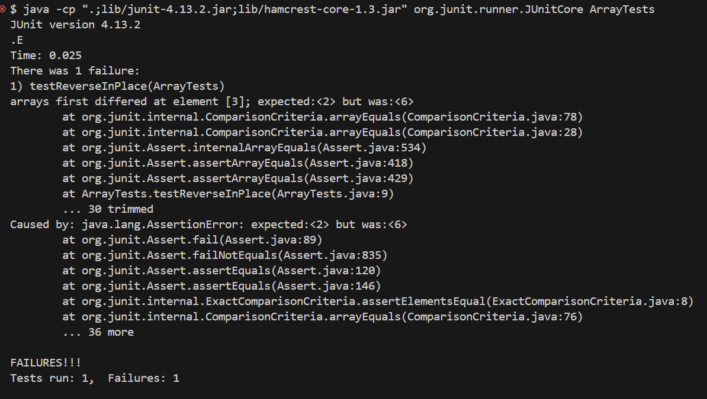

# **Lab Report 3**
---
Associated block of code:
```
public class ArrayExamples {

  // Changes the input array to be in reversed order
  static void reverseInPlace(int[] arr) {
    for(int i = 0; i < arr.length; i += 1) {
      arr[i] = arr[arr.length - i - 1];
    }
  }
```
Failure inducing input:
```
@Test
public void testReverseInPlace() {
    int[] input1 = {7, 3, 2, 6, 4, 1};
    ArrayExamples.reverseInPlace(input1);
    assertArrayEquals(new int[]{1, 4, 6, 2, 3, 7}, input1);
}
```
Non-failure inducing input:
```
@Test
public void testReverseOneElementInPlace() {
    int[] input1 = {5};
    ArrayExamples.reverseInPlace(input1);
    assertArrayEquals(new int[]{5}, input1);
}
```

Screenshot of tests running:



Before fixing the bug:
```
 static void reverseInPlace(int[] arr) {
    for(int i = 0; i < arr.length; i += 1) {
      arr[i] = arr[arr.length - i - 1];
    }
```
After fixing the bug:
```
static void reverseInPlace(int[] arr) {
    for (int i = 0; i < arr.length / 2; i += 1) {
        int new = arr[i];
        arr[i] = arr[arr.length - i - 1];
        arr[arr.length - i - 1] = new;
    }
}
```

In the original implementation, each element of the array was being overwritten with the element located at the mirrored position from the end of the array. This resulted in all elements in the array becoming the same as the last element, effectively losing the original content of the array. The fix corrects the issue by properly swapping elements in the array. In the corrected version, each element is swapped with its corresponding element from the reversed position in the array.


**Part 2:**

`grep-n`:
Case 1 (file):
```
$ grep -n "Introduction" ./technical/biomed/1468-6708-3-1.txt
5:        Introduction
```
Case 2 (directory):
```
$ grep -n "Introduction" ./technical/biomed
grep: ./technical/biomed: Is a directory
```
This option prefixes each line of output with its 1-based line number within its input file. It's useful for quickly identifying the line numbers of occurrences of a specific term within a file, aiding in navigation or referencing specific lines during analysis or debugging tasks.

`grep-c`:
Case 1 (file):
```
$ grep -c "planes" ./technical/911report/chapter-1.txt
16
```
Case 2 (directory):
```
$ grep -c "planes" ./technical/911report
grep: ./technical/911report: Is a directory
0
```
 This option counts the number of lines that match the specified pattern in the given files. It's useful for quickly determining the total number of occurrences of a pattern in one or multiple files, providing a simple count instead of displaying the actual matching lines.
 
`grep-w`:
Case 1 (file):
```
$ grep -w "Cardiovascular" ./technical/biomed/1468-6708-3-1.txt
          Study design: The Cardiovascular Health
          The Cardiovascular Health Study (CHS) is a
        CHS Cardiovascular Health Study
```
The `-w` option matches whole words only, ensuring that the pattern is matched as a standalone word and not as part of a larger word. It's helpful when you want to search for a specific word without getting partial matches or matches within larger words.

Case 2 (directory):
```
$ grep -w "Cardiovascular" ./technical/biomed
grep: ./technical/biomed: Is a directory
```

`grep-l`:
Case 1 (file):
```
$ grep -l "planes" ./technical/911report/*.txt
./technical/911report/chapter-1.txt
./technical/911report/chapter-11.txt
./technical/911report/chapter-12.txt
./technical/911report/chapter-13.1.txt
./technical/911report/chapter-13.2.txt
./technical/911report/chapter-13.3.txt
./technical/911report/chapter-13.4.txt
./technical/911report/chapter-13.5.txt
./technical/911report/chapter-3.txt
./technical/911report/chapter-5.txt
./technical/911report/chapter-6.txt
./technical/911report/chapter-7.txt
./technical/911report/chapter-8.txt
./technical/911report/chapter-9.txt
```
Case 2 (directory):
```
$ grep -l "planes" ./technical/911report
grep: ./technical/911report: Is a directory
```
With the `-l` option, `grep` prints only the names of files with matching lines, rather than the actual matching lines themselves. It's useful when you want to quickly identify which files contain the search term without displaying the matching content, which can be handy when dealing with a large number of files.
