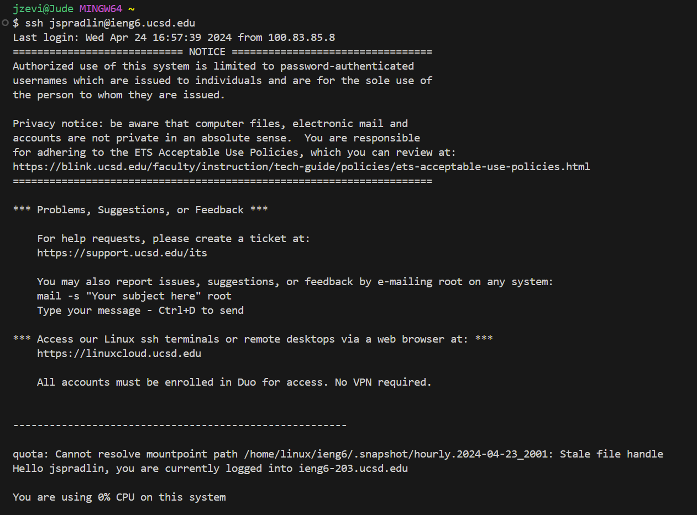
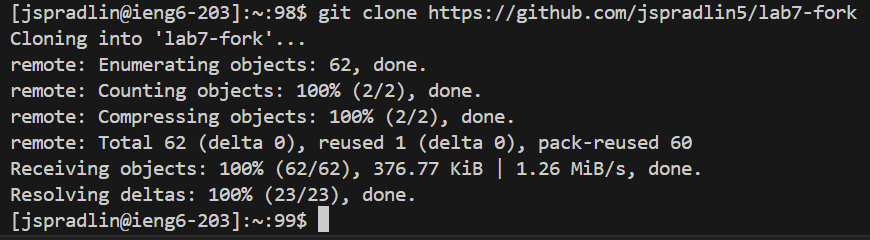
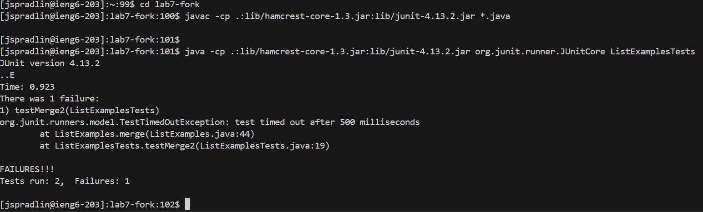
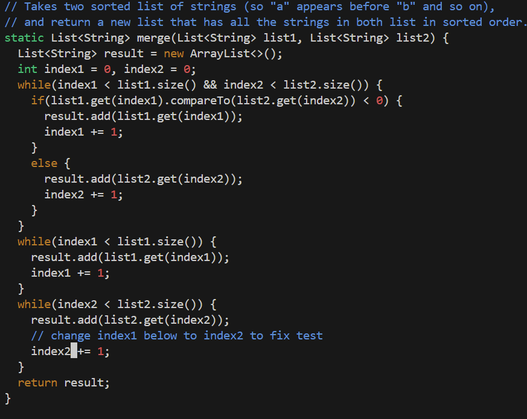
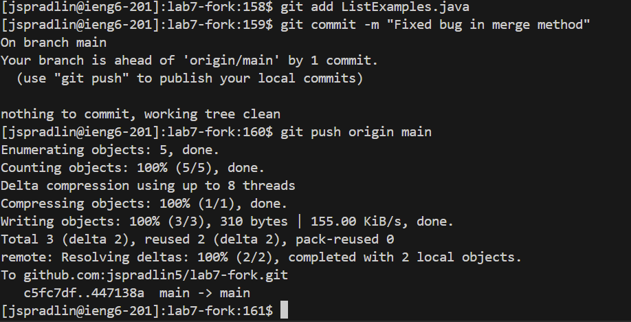

# **Lab Report 4:**
---
Lab Tasks:

4. Log into ieng6
   
5. Clone your fork of the repository from your Github account (using the SSH URL)
   
6. Run the tests, demonstrating that they fail
   
7. Edit the code file to fix the failing test
    
8. Run the tests, demonstrating that they now succeed
    
9. Commit and push the resulting change to your Github account (you can pick any commit message!)
    

**Step 4:**


Keys pressed:
```
ssh<space>jspradlin@ieng6.ucsd.edu<enter>
```
Effects: logged the user into the ieng6 server.


**Step 5:**


Keys pressed:
```
<open-website(https://github.com/jspradlin5/lab7-fork)>
<click-button(<> Code)>
<click-button(copy)>
<open-terminal>
git<space>clone<space><Ctr + V>
```
Effects: First we open the website then copy the url path to the repository. Then we open the terminal and use the git clone command and paste the url after that command to clone the forked repository.

**Step 6:**


Key pressed:
```
cd<space>l<tab><enter>
javac<space>-cp<space>.:lib/hamcrest-core-1.3.jar:lib/junit-4.13.2.jar<space>*.java
java<space>-<space>.:lib/hamcrest-core-1.3.jar:lib/junit-4.13.2.jar<space>org.junit.runner.JUnitCore<space>ListExamplesTests

```
Effects: Navigate into the 'lab7-fork' directory and then write out the commands to run the tests. These commands ran the test and produced the output when they failed.

**Step 7:**


Key pressed:
```
vim<space>vim ListExamples.java<enter>
:set number<enter>
44
e
i
<delete>
2
<esc>
:wq<enter>
```
Effects: first enter 'vim' by inputting the first command so that we can edit the file. Then we search for line 44 and press e to move to the right of the string 'index1' then delete and replace the 1 with a 2. Finally we do `:wq<enter>` to exit vim and save the changes made.


**Step 8:**


Keys pressed:
```
javac<space>-cp<space>.:lib/hamcrest-core-1.3.jar:lib/junit-4.13.2.jar<space>*.java
java<space>-<space>.:lib/hamcrest-core-1.3.jar:lib/junit-4.13.2.jar<space>org.junit.runner.JUnitCore<space>ListExamplesTests
```
Effects: Once again we just typed out in the terminal the commands to run the tests and the output is the result when the tests pass.


**Step 9:**


Key pressed:
```
git<space>add<space>.<enter>
git<space>commit<space>-m<space>"Fixed<space>bug<space>in<space>merge<space>method"<enter>
git<space>push<enter>
```
Effects: first we use `git add` with a period after it to add the changes we made to the correct document. Then we do `git commit` with the message after it to commit the changes to the document. Finally we do `git push` to push the changes to the github repo.
