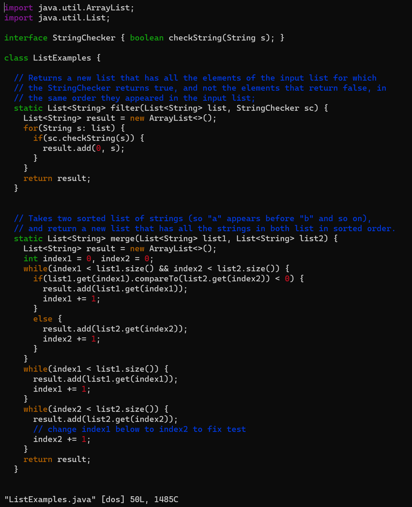
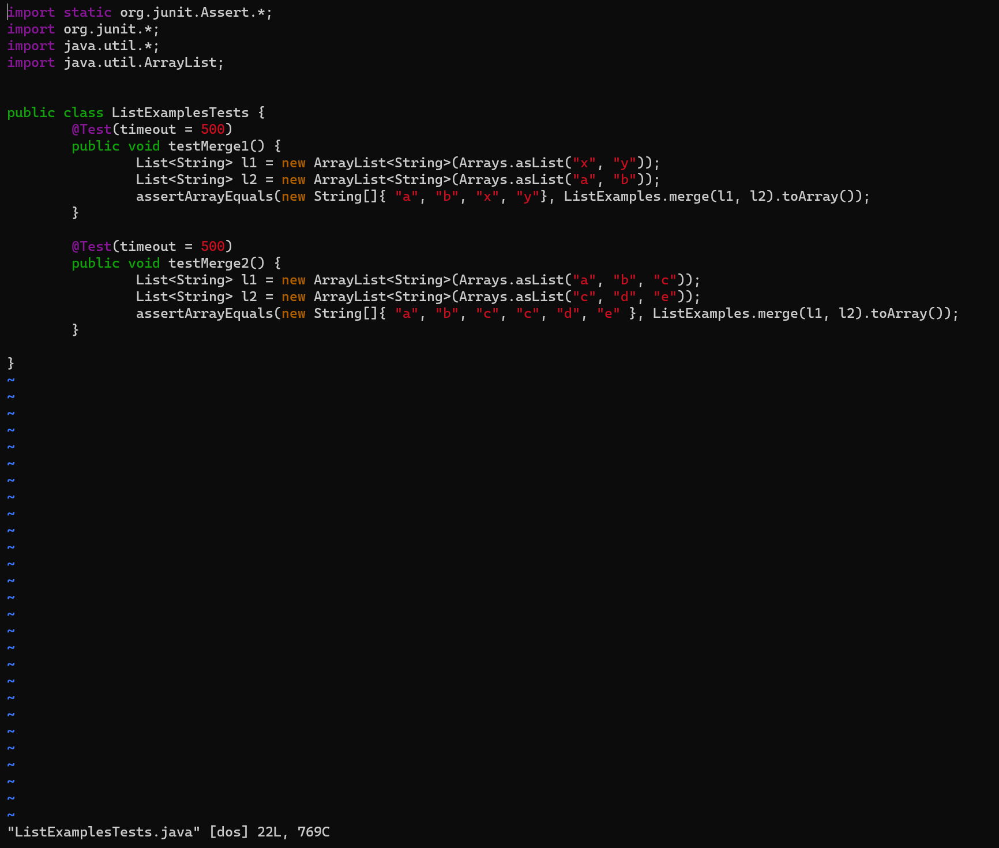
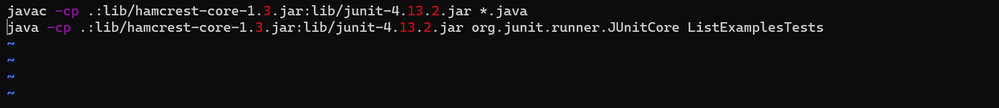

## **Lab Report 5**
---
**Part 1:**

Anonymous student:

  I got this error message when trying to run my grading script
  
  

  I am pretty positive that my bash script is correct, do you have any idea what the potential problem with my code is?
  Could it be something with my grading script or do you think my code is wrong? Thanks.
  

TA or other instructional assistant:

  Could you please provide the code for your bash script I believe that it might be the cause of the problem.

Anonymous student:

  Of course! Here is my code for my grading script
  
  


TA or other instructional assistant:

  Most of your grading script is correct, however there is a problem in your first command line in your grading script. At
  the end of the first line it should be `*.java` and not `ListExamplesTests.java`. Let me know if this works and if you 
  have any additional questions feel free to make another post or come to my office hours!


Anonymous student:

  Thank you! This fixed the error in my grading script and it now runs correctly.
  
  


  ## **Folder Structure:**

```
|-- lib
|-- |-- hamcrest-core-1.3.jar
|-- |-- junit-4.13.2.jar
|-- ListExamples.java
|-- ListExamplesTests.java
|-- test.sh
```


## **File Info:**

**Before:**

`ListExamples.java` Before:




`ListExamplesTest.java` Before:




`test.sh` Before:


**After:**

No changes made to `ListExamples.java` and `ListExamplesTest.java`

`test.sh` after:




## **Part 2:**

During the second half of this quarter, I learned a lot about Bash scripting. Before, I had a basic understanding, but now I appreciate its power in automating tasks, managing files, and integrating different tools. Creating scripts to compile and run Java programs, as well as setting up the environment for testing with JUnit, showed me how Bash can streamline complex workflows. This experience has enhanced my ability to write efficient and effective scripts for various tasks, making my development process more productive.
